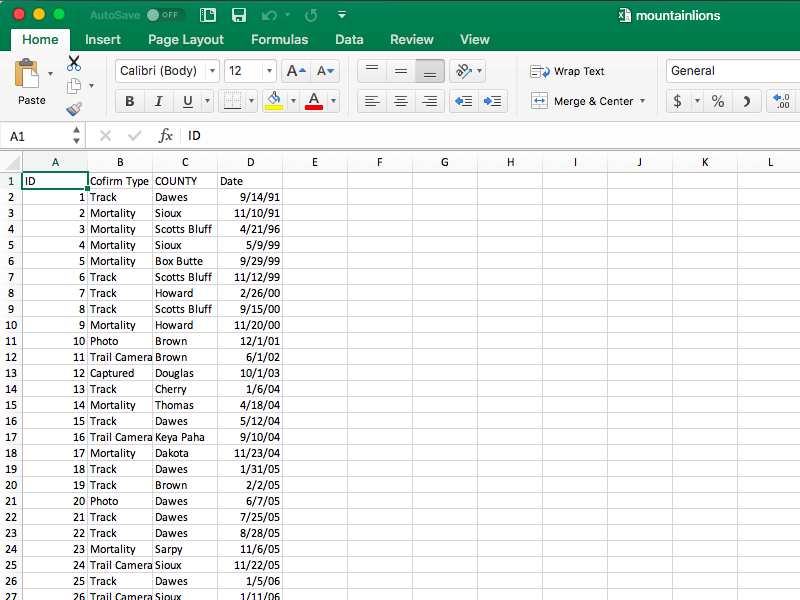
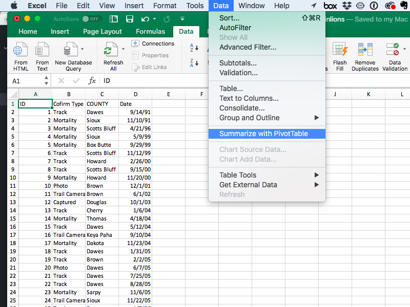
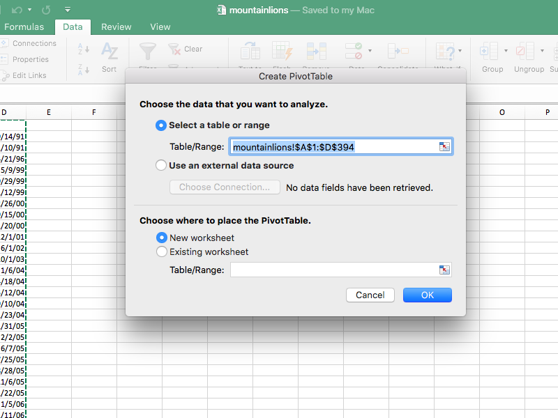
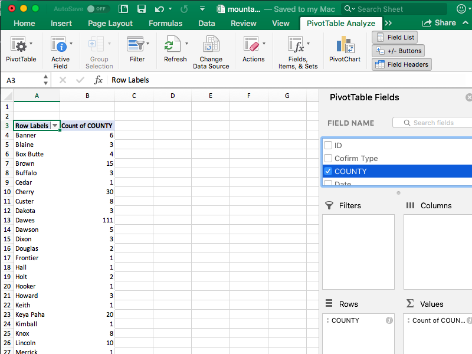
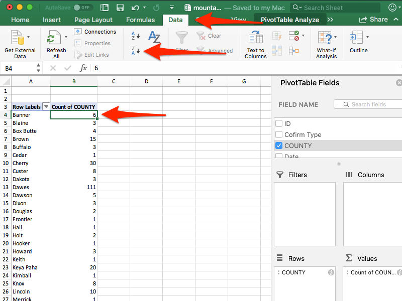
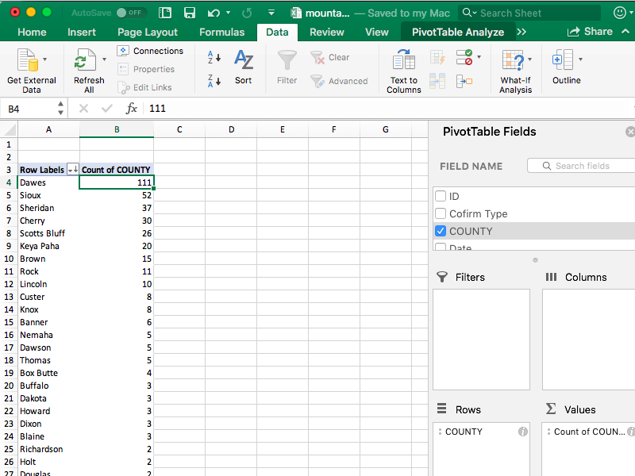

# Group By

Like many newsrooms, reporters at St. Louis Public Radio heard the common story that violent crime goes up when the weather gets hot.

Brent Jones, a visual data journalist there, worked with a reporter and editor to find out.

"We were looking for a summer story, and have talked about putting more of a focus on gun violence," he said.

To do the story, Jones needed three things: police data, weather data, and knowing how to Group By. With data from the St. Louis Police Department, daily high temperature data from the National Weather Service, [the rest was just doing the analysis](https://github.com/stlpublicradio/2018-05-31-crime-and-heat-analysis/blob/master/crimes-and-heat.ipynb).

When they were done, they found the anecdotes were true: [crime in St. Louis does indeed edge higher when the temperature gets hotter](http://news.stlpublicradio.org/post/warm-weather-worries-st-louis-when-temperatures-rise-crime-often-follows#stream/0).

### The nut graph

Group By is one of the most basic, and most critical, skills in data analysis. It takes any number of things and groups them together by some common element. Imagine, if you will, you had a bag of Skittles candy spilled out on the table in front of you. Group By takes the yellow ones and puts them in a pile, and the green ones, and the purple ones, and so on.

The term Group By comes from databases -- specifically the Structured Query Language (SQL) command GROUP BY -- but it has analogues in every analysis platform out there.

In this module, you'll learn:

* The steps to grouping your data together
* An introduction to summarizations after you have grouped the data
* Ordering data to show differences

### The walkthrough

For this exercise, we're going to use Excel, a general purpose spreadsheet program that has been the starting point for data journalists going back decades. There are multiple ways to group data together in Excel. In this module, we're going to use Pivot Tables to do the work.

First you need data. For this example, we're going to use a dataset of verified mountain lion sightings in Nebraska. The data is useful to provide context to stories of the big cats being spotted in places they aren't usually found -- particularly around Nebraska's major cities of Lincoln and Omaha. [Stories pop up](http://krvn.com/regional-news/woman-reports-mountain-lion-sighting-in-lincoln/) from time to time, but rarely include context. The state Game and Parks department keeps track of confirmed sightings. Let's look at that data.

Note: We have four fields:
* ID, an number for each sighting
* A misspelled field that should be Confirm Type, which tells you how the state confirmed that it was a real mountain lion
* COUNTY, which is what you think it is.
* And Date, which is when the sighting occurred.

With this data, what is a logical question to ask? How about this one: Which counties have the most mountain lion sightings?

To answer that, we'll group them together using Pivot Tables. Pivot Tables are very useful, but can be a little tricky if you aren't careful.

Here's a short screencast to show you how it all works.

If screencasts don't work for you, here's a step by step walkthrough. 

First, we'll go up to the Data menu, then click Summarize with PivotTable.

Then, we'll get a window. Normally, Excel does a pretty good job of knowing what data you need and setting sensible defaults, as it does here. But if you need to adjust it in the future, this is where you do it.

Click OK. On the screen that pops up, the major work will happen on the right. Since we want to group by COUNTY, first we'll click on COUNTY. When you do that, you'll see, on the left, that Excel has calculated that there are 393 rows. Next, click, hold and drag COUNTY into the Rows area. Doing that, you should see your in left area that now each county is a row, with a number next to it.

Notice something? It's alphabetical order, not by the numbers. That's bothersome. We can fix that with sorting. Click the number 6 next to Banner County, then click the data tab, find the sort button near the middle, and for a shortcut, just click Z-A.

Things to note:

* If you're not a Nebraska geography nerd, most of those counties are across the north and northwestern parts of the state in an area called the Pine Ridge.
* Lincoln, the city, is in Lancaster County. According to this data, there have been zero confirmed sightings in Nebraska's second most populous county. Omaha is in Douglas County, the state's most populous county, with two confirmed sightings.
* Look carefully at Sheridan County. Scan down the list of counties. See any problems? How might this affect your analysis?

### Resources for instructors

* Potential assignment: Use local or campus crime data to answer a series of questions. Examples: If you have multiple years of data, how many crimes were reported each year? What is the most common crime type? Which month has the most reported crime?
* Potential assignment: Use salary data from your city or university. Use group by and create the following summaries by job title: count, median and mean. Discuss the differences. For instance, my university salary data includes a very expensive football coach, a moderately expensive basketball coach, and a lot of well-paid assistant coaches before we get to chancellors and vice chancellors. How does that affect the numbers?

### Suggested reading

* Jones' [code analyzing crime and temperature data](https://github.com/stlpublicradio/2018-05-31-crime-and-heat-analysis/blob/master/crimes-and-heat.ipynb).
* [Notes on working with big-ish data](https://source.opennews.org/articles/notes-working-big-ish-data/)
